# DOBOT Pick-and-Place Node Logic Charts

This document maps the ROS 2 nodes in this workspace, what each node does, and
how the nodes communicate.

## Diagram Legend

- Solid arrow: topic, TF, or hardware data stream
- Dotted arrow: ROS service, file/configuration handoff, or process control;
  the edge label identifies which one
- Names shown are the default names. Most can be overridden by launch arguments
  or runtime settings.

## 1. Complete Runtime Communication Map

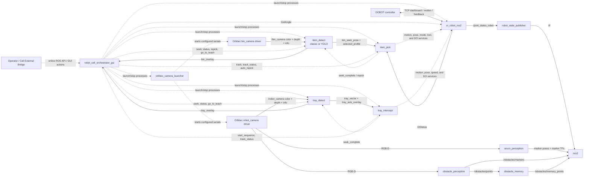

## 2. Robot Bringup and Visualization

### `cr_robot_ros2`

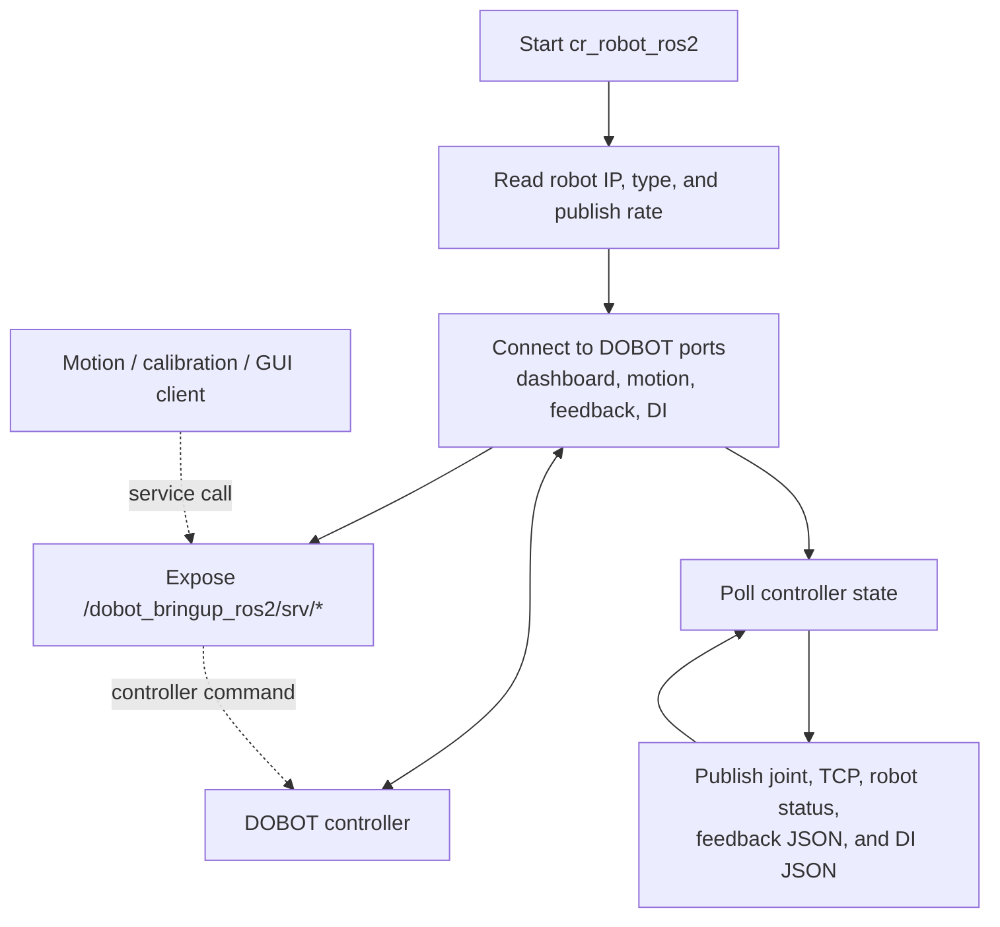

Published state:

| Topic | Main consumers |
| --- | --- |
| `/joint_states_robot` | `robot_state_publisher`, `motion_debug`, YOLO teach |
| `dobot_msgs_v4/msg/RobotStatus` | `motion_debug` |
| `dobot_msgs_v4/msg/ToolVectorActual` | calibration, bin teach, movement calibration, motion debug |
| `/dobot_bringup_ros2/msg/FeedInfo` | diagnostics |
| `/dobot_bringup_ros2/DIStatus_200mS` | `item_pick`, `gripper_control` |

The node exposes the controller command set under
`/dobot_bringup_ros2/srv`, including `MovJ`, `MovL`, `MovLIO`, `Stop`,
`GetPose`, `GetAngle`, `RobotMode`, `SpeedFactor`, `CP`, `DO`, and the
remaining services defined in `dobot_msgs_v4`.

### `robot_state_publisher`, `world_to_base`, and `rviz2`

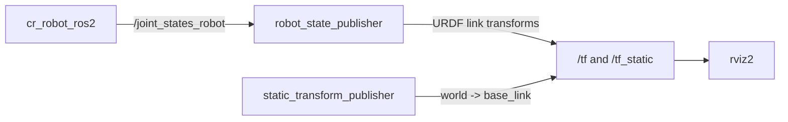

## 3. Camera Launch and Camera Data

`orbbec_camera_launcher` is a launcher node/process, not an image-processing
node. It scans USB devices, matches serial numbers from
`config/camera_bringup/orbbec_cameras.yaml`, starts the Orbbec launch file, and
waits for fresh color and depth messages before starting the next configured
camera. The watchdog continues checking stream freshness and relaunches a
camera driver when its process exits or either image stream becomes stale.

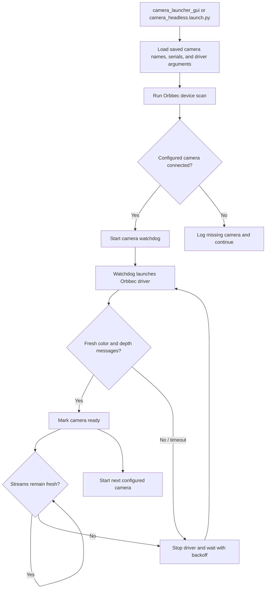

Default camera outputs:

| Camera | Topics |
| --- | --- |
| `bin_camera` | `/bin_camera/color/image_raw`, `/bin_camera/depth/image_raw`, `/bin_camera/color/camera_info` |
| `robot_camera` | `/robot_camera/color/image_raw`, `/robot_camera/depth/image_raw`, `/robot_camera/color/camera_info` |

Watchdog interfaces:

| Type | Default name |
| --- | --- |
| Publisher | `/camera_watchdog/status` (`diagnostic_msgs/msg/DiagnosticArray`) |
| Publisher | `/camera_watchdog/healthy` (`std_msgs/msg/Bool`) |
| Service | `/camera_watchdog/restart_all` (`std_srvs/srv/Trigger`) |

## 4. ArUco and Camera Calibration

### `aruco_perception`

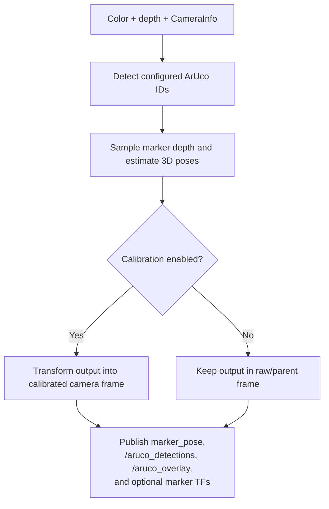

`aruco_perception/perception_calibration` is a small static-TF helper. It loads
an eye-on-hand calibration YAML and publishes
`Link6 -> arm_calibrated_camera_link`.

### Calibration Workflow Nodes

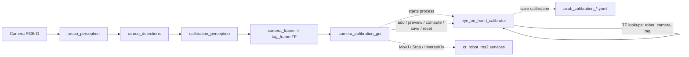

Node responsibilities:

| Node | Responsibility |
| --- | --- |
| `camera_calibration_gui` | Operator UI, motion generation, IK checks, overlay display, and solver service client |
| `calibration_perception` | Fits one board pose from `/aruco_detections` and broadcasts `camera_frame -> tag_frame` |
| `eye_on_hand_calibrator` | Collects robot/tag TF samples, solves AX=XB, previews the result, and writes calibration YAML |
| `aruco_perception/perception_calibration` | Loads a saved YAML and publishes the calibrated camera static TF |

### `platform_calibration`

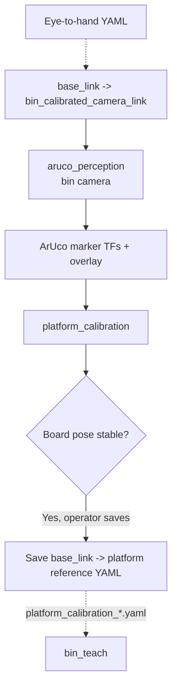

## 5. Teaching Nodes

### `bin_teach` (classic and YOLO packages)

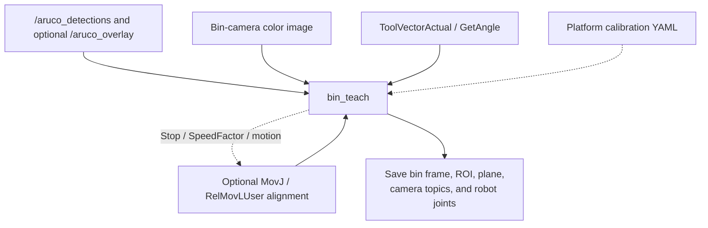

### `item_teach`

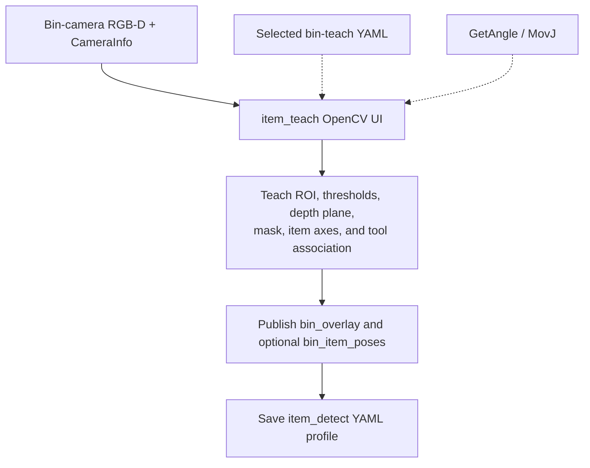

### `item_teach_yolo`

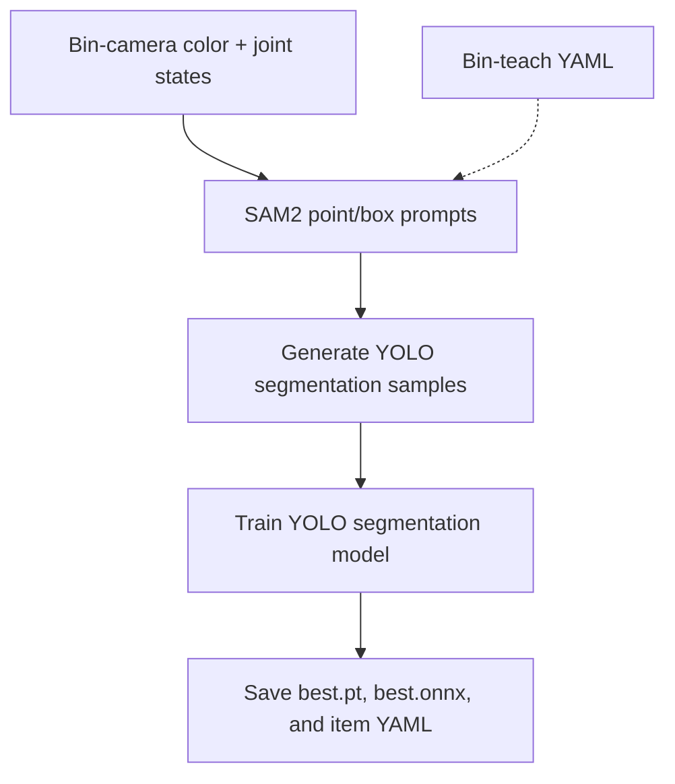

### `tray_teach`

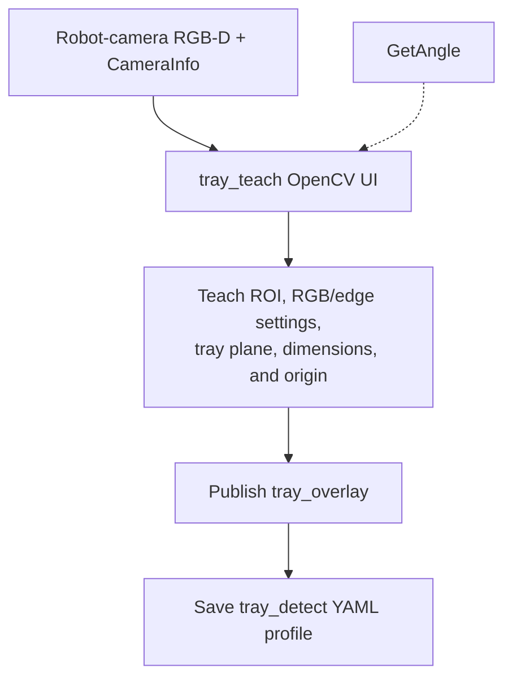

## 6. Runtime Perception Nodes

### `item_detect` (classic or YOLO)

Both implementations keep the external node name and handoff protocol
compatible with `item_pick` and the orchestrator.

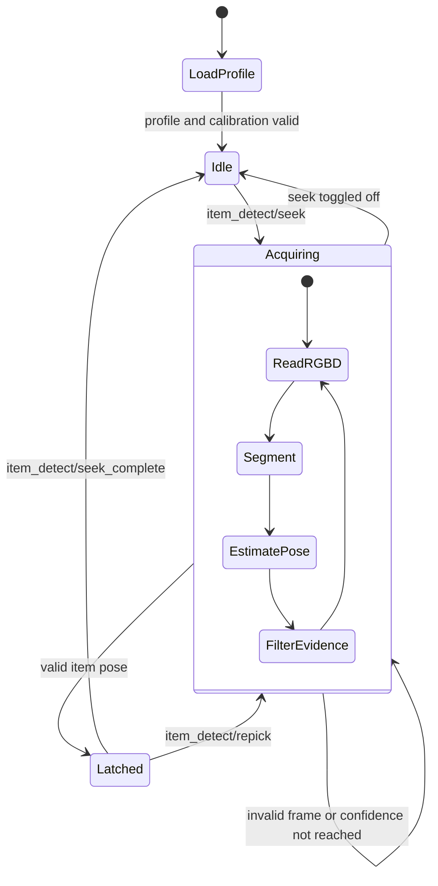

Interfaces:

| Direction | Default interface |
| --- | --- |
| Subscribe | bin-camera color, depth, and camera info |
| Publish | `bin_overlay`, `bin_seek_pose`, `bin_item_poses`, `bin_cube_marker` |
| Publish, latched | `item_detect/selected_profile` |
| Provide services | `item_detect/seek`, `repick`, `seek_complete`, `seek_status`, `go_to_teach` |
| Call services | `/dobot_bringup_ros2/srv/MovJ`, camera exposure services |

### `tray_detect`

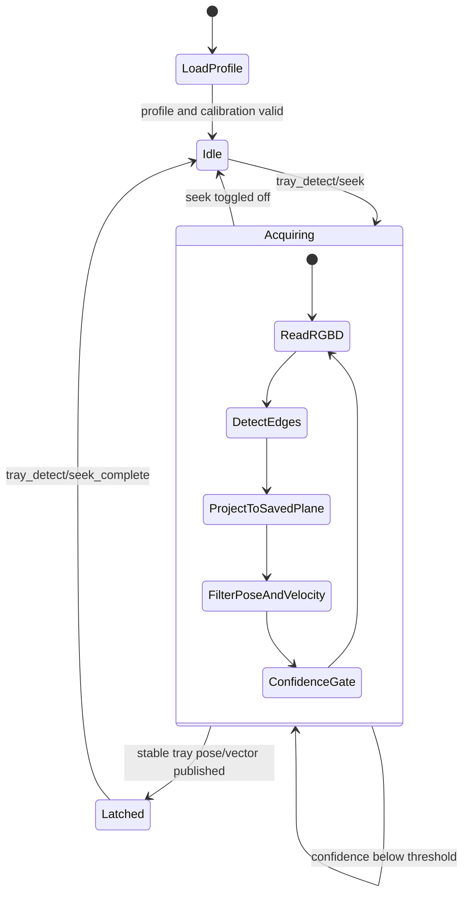

Interfaces:

| Direction | Default interface |
| --- | --- |
| Subscribe | robot-camera color, depth, and camera info |
| Publish | `tray_overlay`, `tray_pose`, `tray_axis_overlay`, `tray_vector`, `tray_cube_marker` |
| Provide services | `tray_detect/get_tray_dimensions`, `seek`, `seek_complete`, `seek_status`, `go_to_teach` |
| Call services | `/dobot_bringup_ros2/srv/MovJ`, camera exposure services |

## 7. Item Pick Logic

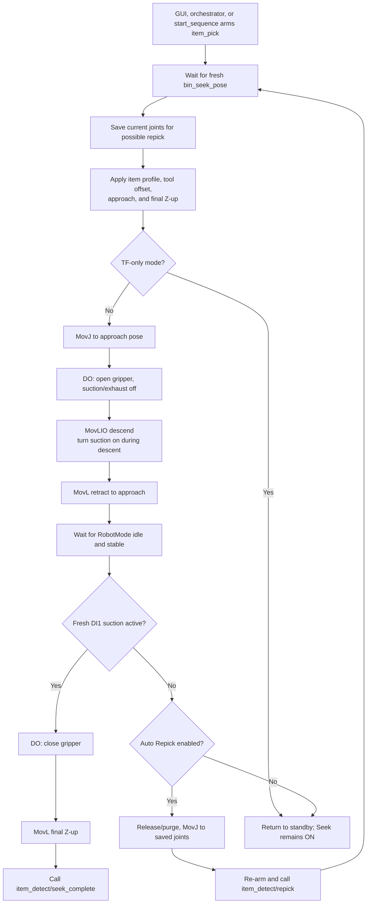

`item_pick` subscribes to `bin_seek_pose`,
`item_detect/selected_profile`, and
`/dobot_bringup_ros2/DIStatus_200mS`. It provides `item_pick/track`,
`item_pick/track_status`, `item_pick/start_sequence`, and
`item_pick/set_auto_repick`. Its DOBOT clients are `MovJ`, `MovL`, `MovLIO`,
`GetAngle`, `GetPose`, `RobotMode`, `SetTool`, `Tool`, `Stop`, and `DO`.

## 8. Tray Intercept Logic

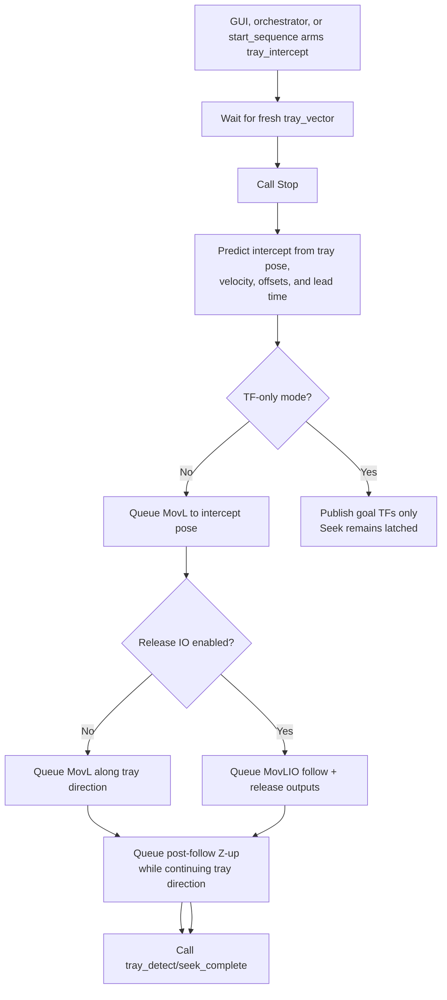

`tray_intercept` subscribes to `tray_vector` and `tray_axis_overlay`, calls
`tray_detect/get_tray_dimensions`, and provides `tray_intercept/track`,
`tray_intercept/track_status`, and `tray_intercept/start_sequence`. Its DOBOT
clients are `MovL`, `MovLIO`, `Stop`, `CP`, `DO`, `GetPose`, and
`SpeedFactor`.

## 9. Robot Cell Orchestrator

### Offline Cycle

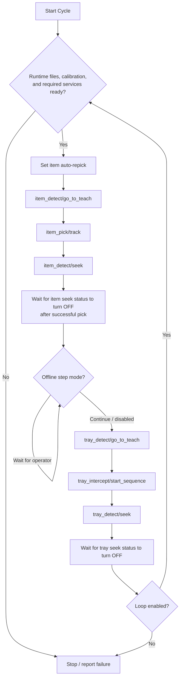

### Online Cycle

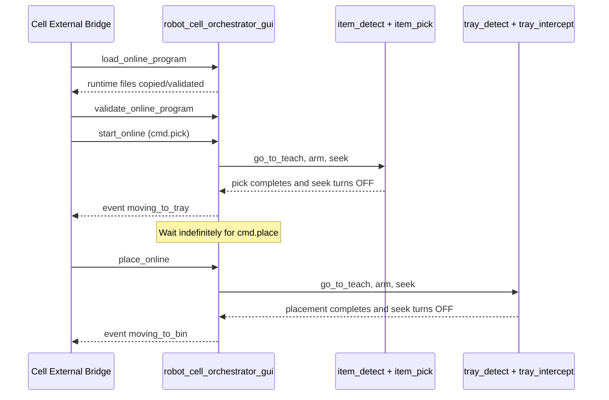

Orchestrator ROS interfaces:

| Type | Default name |
| --- | --- |
| Service | `robot_cell_orchestrator/load_online_program` |
| Service | `robot_cell_orchestrator/validate_online_program` |
| Service | `robot_cell_orchestrator/start_online` |
| Service | `robot_cell_orchestrator/place_online` |
| Publisher | `robot_cell_orchestrator/events` |
| Subscribers | `bin_overlay`, `tray_overlay` |
| Robot client | `/dobot_bringup_ros2/srv/GetAngle` |

`robot_runtime_headless.launch.py` is a launch composition, not a ROS node. It
can start the configured camera drivers, `item_detect`, `item_pick`,
`tray_detect`, `tray_intercept`, and RViz using the shared orchestrator runtime
settings.

## 10. External RabbitMQ Bridge

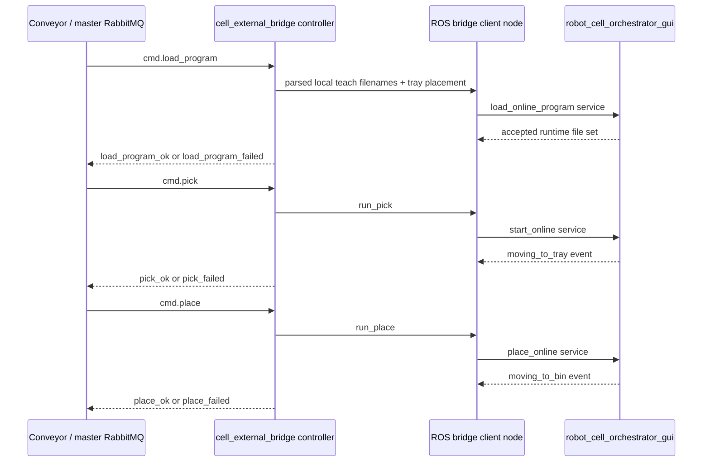

The ROS client node created inside the bridge is named
`cell_external_bridge_robot_cell_orchestrator_client`. RabbitMQ communication
does not talk directly to motion or perception nodes; all physical-cycle
commands pass through the orchestrator API.

## 11. Obstacle Perception

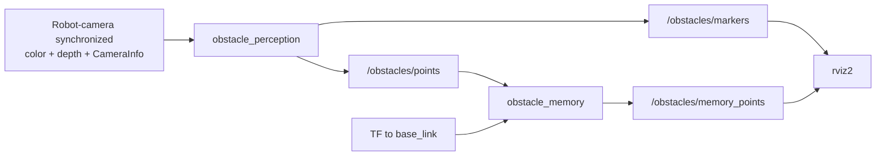

`obstacle_perception` projects depth pixels into 3D, voxelizes them, removes
small floating groups, and publishes live data. `obstacle_memory` transforms
the live cloud into `base_link`, accumulates stable voxels, and can suppress
points still visible in the current camera frustum.

## 12. Diagnostic and Utility Nodes

| Node | Subscribes / reads | Calls / produces |
| --- | --- | --- |
| `gripper_control_gui` | `/dobot_bringup_ros2/DIStatus_200mS` | `/dobot_bringup_ros2/srv/DO` |
| `motion_debug_gui` | joint state, TCP state, robot status | enable/disable, jog, drag, tool, payload, speed, acceleration, `MovJ`, `MovL`, and stop services |
| `movement_calibration` | `ToolVectorActual` | `CP`, `SpeedFactor`, and `MovL`; writes speed calibration JSON |
| `movement_calibration_gui` | Operator settings | Launches `movement_calibration` |

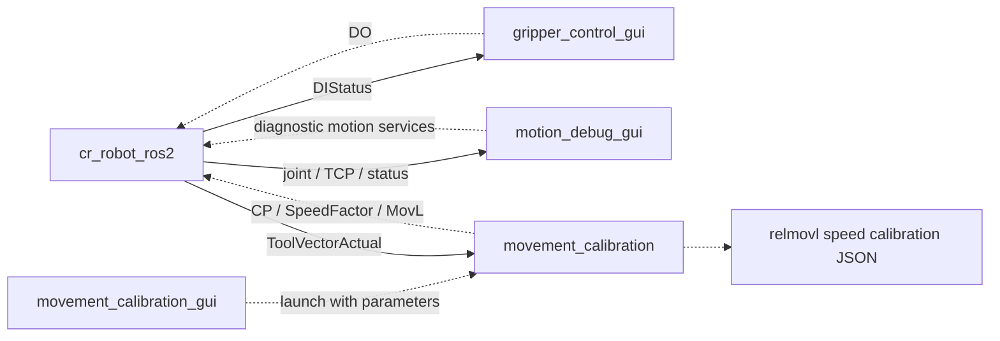

## 13. Node and Executable Inventory

| Package | Node / process | Executable |
| --- | --- | --- |
| `cr_robot_ros2` | DOBOT controller bridge | `cr_robot_ros2_node` |
| `dobot_rviz` | Robot model TF publisher | `robot_state_publisher` |
| `dobot_rviz` | World anchor | `static_transform_publisher` |
| `dobot_rviz` | Visualizer | `rviz2` |
| `orbbec_camera_launcher` | Camera launcher GUI | `camera_launcher_gui` |
| `aruco_perception` | ArUco RGB-D detector | `aruco_detector_node` |
| `aruco_perception` | Saved calibration TF helper | `perception_calibration` |
| `camera_calibration` | Calibration GUI | `camera_calibration_gui` |
| `camera_calibration` | Four-marker board fitter | `calibration_perception` |
| `camera_calibration` | AX=XB solver | `eye_on_hand_calibrator` |
| `platform_calibration` | Platform calibration GUI/node | `platform_calibration` |
| `obstacle_perception` | Live obstacle projector | `obstacle_perception_node` |
| `obstacle_perception` | Persistent obstacle map | `obstacle_memory_node` |
| `item_perception` | Bin teaching | `bin_teach` |
| `item_perception` | Classic item teaching | `item_teach` |
| `item_perception` | Classic item detection | `item_detect` |
| `item_perception_yolo` | Bin teaching | `bin_teach` |
| `item_perception_yolo` | SAM2/YOLO teaching | `item_teach_yolo_node.py` |
| `item_perception_yolo` | YOLO runtime detection | `item_detect_yolo_node.py` |
| `tray_perception` | Tray teaching | `tray_teach_node` |
| `tray_perception` | Tray runtime detection | `tray_detect_node` |
| `item_pick` | Item motion and GUI/service endpoint | `item_pick` |
| `tray_intercept` | Tray motion and GUI/service endpoint | `tray_intercept` |
| `robot_cell_orchestrator` | Main cell coordinator | `robot_cell_orchestrator_gui` |
| `gripper_control` | Manual gripper GUI | `gripper_control_gui` |
| `motion_debug` | Robot commissioning GUI | `motion_debug_gui` |
| `movement_calibration` | Speed calibration worker | `movement_calibration` |
| `movement_calibration` | Calibration launcher GUI | `movement_calibration_gui` |
| `cell_external_bridge` | RabbitMQ controller | `cell-external-bridge` |

`dobot_msgs_v4` contains message and service definitions; it does not start a
node.
